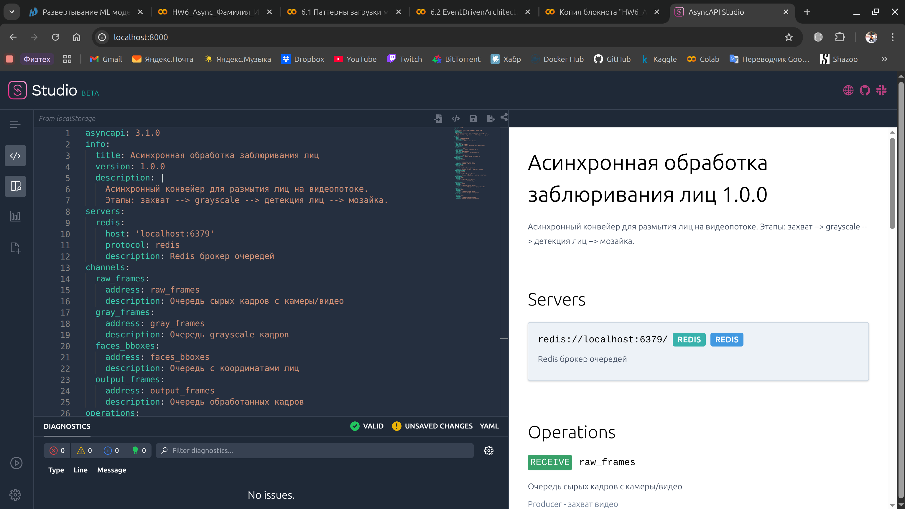
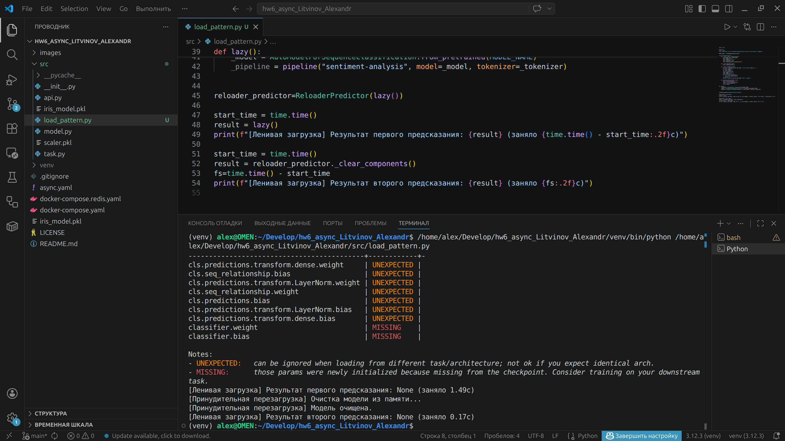
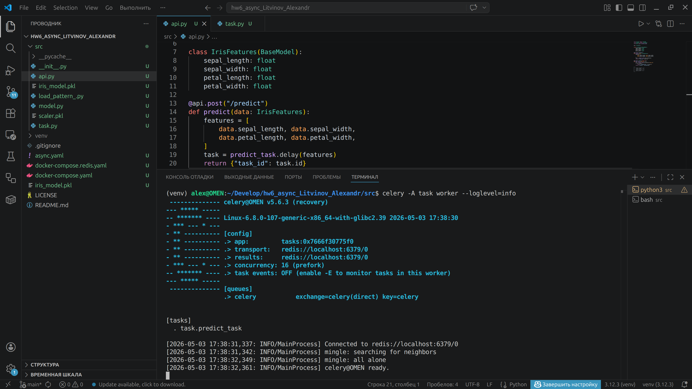
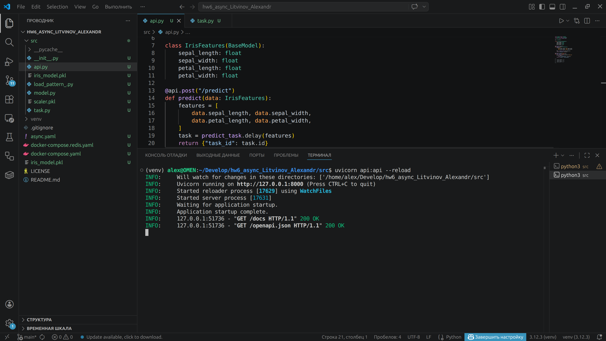
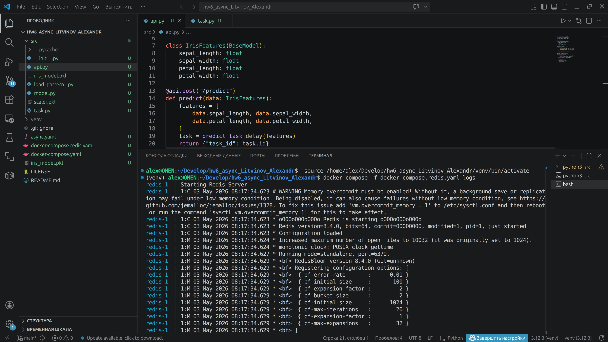
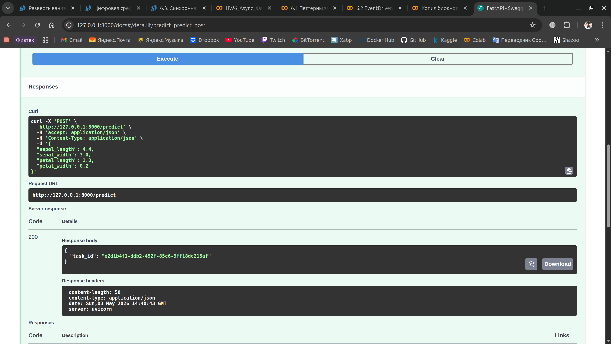
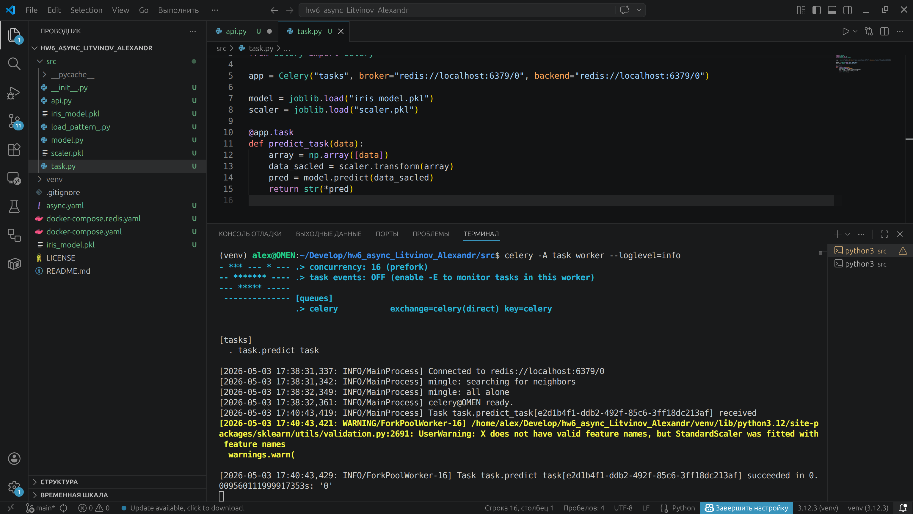
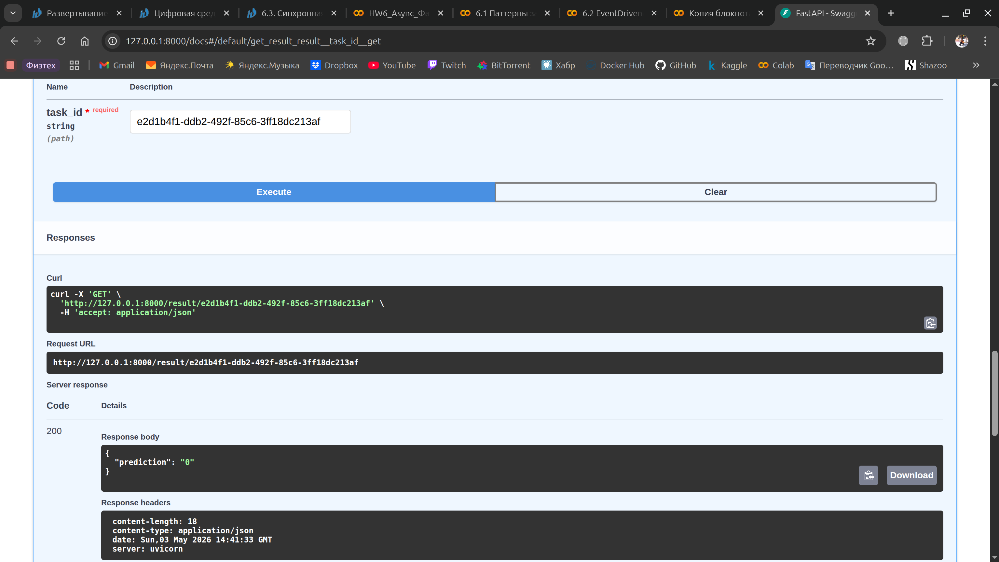

# Домашнее задание 6. Подключение очереди и асинхронной обработки

### 1. Оценить необходимость асинхронной обработки

При синхронном подходе общее время на обработку кадра равно сумме всех этапов. Процессор простаивает во время захвата и вывода, так как это I/O-задачи. При асинхронном конвейере (3 параллельные задачи) система выдает готовый кадр каждые максимальное время этапа, то есть мы ограничены самой долгой операцией.

В синхронной версии одно ядро простаивает, пока другое работает (или все этапы выполняются на одном ядре). Асинхронность позволяет занять все ядра разными этапами конвейера.

Асинхронная обработка позволит увеличить FPS на 30–50% за счет параллелизма (захват --> детекция --> постобработка) благодаря использованию многоядерности и возможности захватывать следующий кадр (I/O-задачи не блокируют вычисления), пока текущий обрабатывается детекцией.

### 2. Выбрать брокер очередей, спроектировать асинхронный API для модели

Документация реализована здесь [ссылка на файл async.yaml](async.yaml)



### 3. Выбрать стратегию (паттерн) загрузки моделей и реализовать ее

Паттерн реализован здесь [ссылка на файл load_pattern.py](src/load_pattern.py)



### 4. Создать загрузку данных  батчами в модель

```
buffer = []
while True:
    buffer.append(next_request())

    if len(buffer) > 64 or timeout_reached(30):
        batch = prepare_batch(buffer)
        results = model.predict(batch)
        send_back(results)
        buffer.clear()
```

### 5. Создать онлайн-загрузку данных в модель

Для демонстрации, предварительно сохранена простая модель-классификатор ирисов. В `api.py` реализовно два эндпоинта: post-запрос на отправку данных для классификации цветка, возвращающий `task_id` задачи в очереди; второй - get-запрос с передачей id задачи и получением результата.













### 6. Итоговое оформление и выводы

Самому писать документацию довольно долго, особенно если ты привык, что такие фреймворки как `FastAPI` и `FastStream` сами генерируют `OpenAPI` и `AsyncAPI` документации самостоятельно, исходя из аннотаций и кода в целом.

Понятно, что синхронная обработка потоковых видеоданных не является эффективной. Однако, написание корректно работающего асинхронного, распараллеленного процесса - задача сложная и требует большого опыта и знаний. Так же, сам язык Python вносит свои ограничения в виде GIL (хотя его можно и отключить в новых версиях), гонка состояний, накладные расходы в случае многопроцессорности и так далее. Проектирование таких систем - та ещё задача.

Сценарий инициализации модели и её дальнейшего использования зависит от целеполагания и сценария использования. Здесь мы учитывает то, какой объем вычислительных ресурсов нам доступен, как часто происходит обращение к модели, как быстро необходимо отдавать ответ, понимаем ли мы какой будет ожидаемая нагрузка и режим эксплуатации. Единого, универсального паттерна не существует и каждый применим в разных случаях.
